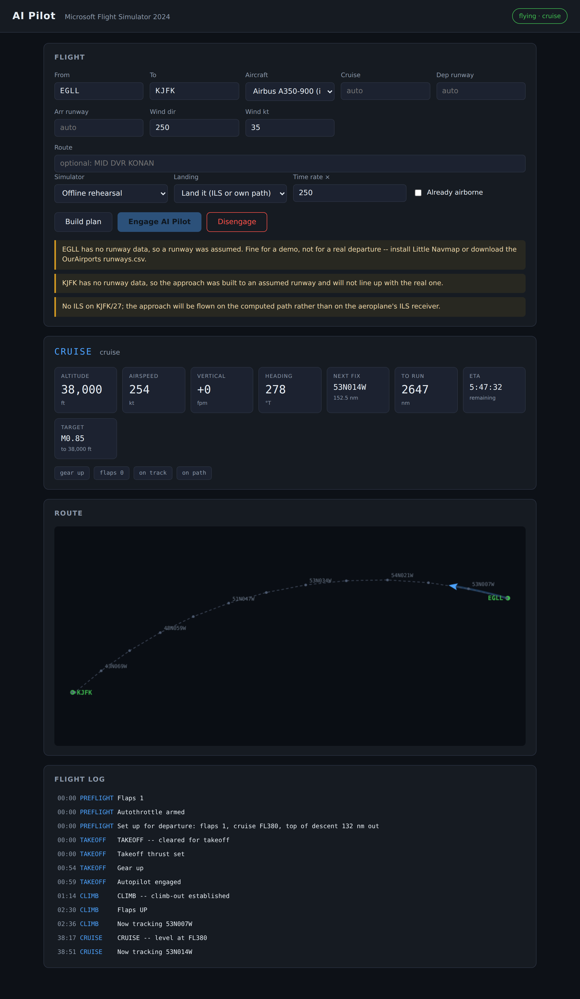

# AI Pilot for Microsoft Flight Simulator

**Works on MSFS 2020 and MSFS 2024.**

MSFS 2020 had an **AI Pilot** button. You typed a departure and a destination,
pressed it, and the aeroplane flew itself there. MSFS 2024 dropped it, and
nothing equivalent shipped in its place — and in MSFS 2020 it is unreliable on
most airliners, the default 787 especially.

This is that button, rebuilt — as a small program that flies the aeroplane you
already own, through SimConnect, rather than as a modification to any aircraft.

**Flying MSFS 2020?** Read [docs/MSFS2020.md](docs/MSFS2020.md) first. It covers
why the built-in AI Pilot behaves the way it does, three settings on your machine
that cause most of it and cost nothing to fix, and what this does differently on
the default 787.

```
python -m aipilot fly EGLL KJFK --aircraft b787-10
```

It takes off, climbs on a proper speed schedule, follows a great circle, starts
down at a top of descent it computes the way a crew does, joins the approach —
straight in, via a base leg, or via a full circuit, depending on which direction
it is arriving from — configures for landing on speed rather than on mileage,
and lands. On an ILS it hands the last part to the aeroplane's own autoland. On
a runway without one it flies its own path down and flares. If the approach is
not stable at five hundred feet, it goes around and tries again.

Nothing is installed into the simulator and no aircraft file is modified.

## The aeroplanes

| Key | Aircraft | How it is flown |
|---|---|---|
| `b787-10`, `b787-9` | Boeing 787-10 / 787-9 (default and Horizon) | Standard SimConnect events. Nothing extra needed. |
| `a350-900`, `a350-1000` | iniBuilds A350 | Standard events. See [docs/AIRCRAFT.md](docs/AIRCRAFT.md). |
| `a380-800` | Airbus A380-800 | Standard events. |
| `a330-900` | Headwind A330-900neo | FlyByWire-convention FCU, via the WASM bridge. |
| `a320neo` | Airbus A320neo | FlyByWire-convention FCU, via the WASM bridge. |

Aliases work too: `--aircraft 787`, `--aircraft a350`, `--aircraft headwind`, or
an ICAO type code such as `B78X`.

Anything not listed still flies, on a conservative generic profile.

**Please read [docs/AIRCRAFT.md](docs/AIRCRAFT.md) before flying an Airbus.** There
is a real limitation there, it is explained honestly, and there is a tool to work
around it.

## Getting started

Requires Python 3.9 or newer. **There are no dependencies to install** — not one.

```bash
git clone <this repository>
cd msfs2024-ai-pilot

# Fly a whole flight with no simulator at all, to see what it does:
python -m aipilot fly EGLL EGCC --sim mock --speed 200

# Check what it can see on your machine:
python -m aipilot doctor

# Fly for real, with the simulator running and an aeroplane on a runway:
python -m aipilot fly EGLL LFPG --aircraft b787-10 --msfs 2020
```

On Windows there are double-clickable versions in `windows\`, so none of this
has to be typed:

| | |
|---|---|
| `Try-It-Offline.bat` | flies a whole flight with no simulator involved |
| `Check-My-Setup.bat` | checks everything and says what is missing |
| `Find-SimConnect.bat` | finds SimConnect.dll on your PC and puts it in place |
| `Fly.bat` | asks where to, then flies there |
| `Fly-My-SimBrief-Plan.bat` | flies the plan you last made in SimBrief |
| `Fly-With-Debug.bat` | the same, but records a trace for diagnosis |
| `Read-Debug-Trace.bat` | summarises the newest trace and says what looks wrong |
| `AI-Pilot-Panel.bat` | opens the control panel in your browser |

You never touch the simulator's own AI Pilot — this replaces it, and leaving it
switched on means two things are flying the same aeroplane.

There is also a control panel in the browser, which is the closer analogue of
the original button:

```bash
python -m aipilot ui --open
```



Full setup, including where to get proper runway and ILS data, is in
[docs/INSTALL.md](docs/INSTALL.md).

## On the ground

With taxiway data available it pushes back, taxis to the runway on the real
taxiways, lines up and goes — and on arrival it vacates, taxis in and parks on
a stand, with lights and cabin signs set correctly throughout. Without that
data it does not move, says so, and takes over once you have taxied out and
lined up yourself.

Taxiway data means **Little Navmap**, and only Little Navmap. There is no
taxiway CSV to download. `python -m aipilot doctor --airport KJFK` tells you
in as many words whether your own home airport has it.

It reads **your installed scenery**, via Little Navmap, so custom airports are
your custom airports. It cannot see obstacles — nothing in SimConnect exposes
scenery — so "avoiding things" means staying on the centrelines.
[docs/GROUND.md](docs/GROUND.md) sets out exactly what that does and does not
cover.

## What it does, in order

**Preflight** — picks runways from the wind, works out a cruise level from the
distance and the direction (odd thousands eastbound, even westbound), builds the
route, tunes the arrival ILS, sets takeoff flap and arms the autothrottle.

**Takeoff** — takeoff thrust, runway heading, autopilot in at 400 ft, gear up
once climbing.

**Climb** — 250 knots below 10,000 ft, then the type's climb speed, then its
climb Mach. Flaps come up as speed allows, one notch at a time, against the
placard for the setting currently out.

**Cruise** — follows the great circle, correcting for wind drift, holding the
centreline to a fraction of a mile.

**Descent** — starts down at a top of descent computed from the height to lose,
the approach geometry, and how much room the aeroplane needs to slow down. The
deceleration allowance is spent by flying the whole descent slightly shallower,
not by levelling off part way down.

**Approach** — joins the final approach course, slows on a schedule, puts the
flaps and gear out as the speed permits, arms the ILS. Checks the approach at
five hundred feet: configured, on speed, on the centreline, at a sensible rate.
If not, it goes around, climbs to three thousand feet, and repositions.

**Landing** — ILS autoland where there is one. Otherwise it flies its own path
and flares on an exponential law, touching down at a hundred to a hundred and
fifty feet a minute. Or, if you would rather land it yourself, it hands over at
two hundred feet, stable and configured, and tells you so.

## Options worth knowing

```bash
--sim mock --speed 200        # rehearse the whole flight offline, fast
--autoland handover           # it flies the approach; you land it
--arrival-runway 27L          # override the runway choice
--route "MID DVR KONAN"       # follow specific fixes where it can resolve them
--cruise 350                  # force a flight level
--wind 250/45                 # plan against a wind you name
--simbrief YOUR_USERNAME      # fly your latest SimBrief plan, runways and all
--debug                       # record a trace of the flight, for diagnosis
--no-metar                    # do not look up the weather; plan as if calm
--airborne                    # engage with the aeroplane already flying
--msfs 2020                   # which sim, when you have both installed
--no-taxi                     # you taxi to the runway, it flies from there
--no-lights                   # do not touch any switches
```

## How it compares

Microsoft's own AI Pilot in MSFS 2024 flies takeoff, cruise, approach and
landing, and the [documented weak points](https://flyawaysimulation.com/ask/answers/use-ai-pilot-copilot-msfs-2024/)
are taxiing, short runways, and routes with discontinuities. Users report
[arriving high and fast and going around at 600 ft](https://forums.flightsimulator.com/t/a-i-pilot-still-almost-completely-useless-certainly-hugely-unreliable-and-error-prone/585347),
and landings that use most of the runway.

This program was audited against those same failure modes, and had versions of
two of them. It arrived at the 500 ft gate around 500 ft to one side of the
centreline and touched down in the grass, while reporting itself lined up; and
it began its flare at 80 ft and floated 3000 ft down the runway. Both are
fixed, and both now have tests with tolerances tight enough to catch a
recurrence — the old ones allowed half a nautical mile.

It does taxi, which the reference implementation does not, wherever Little
Navmap has the data.

## Which runway it picks

The runway is most of the flight plan: get it wrong and the taxi goes to the
wrong end of the field and the approach is built onto a runway nobody is using.

It no longer guesses. Each end is resolved on its own — a single wind applied to
both is wrong for anything longer than a hop — from the runway you named, your
SimBrief plan, the simulator's own wind at the departure end, or the current
METAR, in that order. Every plan says what it chose and why:

```
KJFK departure runway 04L: the METAR 040 at 14 kt, +14 kt down the runway.
EGLL arrival runway 27R: the METAR 250 at 11 kt, +10 kt down the runway.
```

The weather lookup is automatic, free, needs no account, and falls back to calm
without complaint if the network is not there.

If you already plan in SimBrief, fly the plan you made and skip the typing:

```bash
python -m aipilot fly --simbrief YOUR_SIMBRIEF_USERNAME
```

[docs/RUNWAYS.md](docs/RUNWAYS.md) has the full order of preference, what gets
taken from a SimBrief release, and why FlightRadar24 is not one of the sources.

## When something goes wrong

Fly it again with `--debug` and it writes down what happened — what the
aeroplane was doing, what the AI Pilot asked for, and every event it sent to the
simulator. Then:

```bash
python -m aipilot debug-report logs/flight-20260902-183342-KJFKKIAD.jsonl
```

which prints the phase timeline, a count of every command sent, and a list of
what looks wrong. On Windows that is `Fly-With-Debug.bat` and
`Read-Debug-Trace.bat`.

The command trace is the part that matters: an event repeated every cycle is
invisible in any summary and obvious here. It found one the first time it ran —
TOGA being pressed 296 times in a single takeoff roll. Nothing personal goes in
the file, and your home directory is stripped out of any path.
[docs/DEBUG.md](docs/DEBUG.md) covers the rest.

## If the autopilot keeps dropping out

It watches for that and puts it back, which is the difference between an
aeroplane that quietly stops flying and one that keeps going. If it keeps
happening it stops papering over it and tells you what to look at — almost
always a joystick axis with a little jitter on it, a control bound twice, or the
simulator's own AI piloting assistance switched on and fighting for the
aeroplane. [docs/MSFS2020.md](docs/MSFS2020.md) has the details.

## Navigation data

Two different files, doing two different jobs. This trips people up, so plainly:

| What you want | What provides it |
|---|---|
| Airports and their positions | any of the three below |
| Runways, thresholds, ILS | Little Navmap **or** OurAirports `runways.csv` |
| **Taxiways, stands, pushback** | **Little Navmap only** |

**There is no taxiway CSV.** OurAirports publishes airports, runways, navaids and
frequencies; it does not publish taxiways, and no file you can download will add
them. Taxiway data comes from exactly one place — Little Navmap's scenery
database, which it builds by scanning the scenery your simulator has installed,
your custom airports included. Without it the AI Pilot will not push back or
taxi: put the aeroplane on the runway yourself and it flies from there.

Sources are consulted in this order:

1. **Little Navmap's scenery database** — the best source, and the only one with
   taxiways. Built from the scenery the simulator actually flies over, so its
   runways, ILS frequencies and gates match what you see. Found automatically.
2. **OurAirports CSVs** — public domain, one download, exact runway thresholds
   worldwide. No ILS, no taxiways. Put `airports.csv` and `runways.csv` in the
   folder you run the program from, or in a `navdata` folder beside it. Next to
   `SimConnect.dll` is not one of the places it looks unless that happens to be
   the same folder.
3. **A small bundled sample** — enough to fly a demo out of the box. No runway
   data, so approaches are built to *assumed* runways that will not line up with
   the real ones. It says so, loudly, every time.

To see exactly what you have, for the airport you actually fly from:

```bash
python -m aipilot doctor --airport KJFK
```

It names the sources it found, says whether the runways and ILS are real, and
says in as many words whether that airport can be pushed back from and taxied
at — and if not, where it looked and what would fix it.

## Honesty about the limits

- **No published procedures.** SIDs, STARs and instrument approaches are
  licensed data. Everything here is geometry: a great circle and a computed
  approach. It will not fly the arrival ATC would give you, and at a busy
  airport it will not be flying where traffic expects.
- **No terrain awareness.** The descent path is computed to the runway, not
  around what is between here and there. Do not point it across the Alps at a
  low cruise level and walk away.
- **No traffic, no ATC, no weather avoidance.** It reads the wind to choose a
  runway; it does not fly around a thunderstorm or answer a controller.
- **No crosswind or runway-length limit.** The runway is chosen from the wind,
  so a bad one is unusual, but if you force one with `--arrival-runway` nothing
  checks it against the aeroplane. At about 30 kt of crosswind it lands roughly
  a hundred feet off the centreline — on the paved surface, but not by much.
- **No published procedures from SimBrief either.** `--simbrief` takes the
  route's fixes, the runways and the cruise level. The SID and STAR names in the
  route string are dropped, because this program flies fix to fix.
- **Airbus local variables.** See [docs/AIRCRAFT.md](docs/AIRCRAFT.md). Short
  version: the parts that are documented are implemented, the parts that are not
  are left empty rather than guessed, and there is a tool to find them yourself.

## Testing

```bash
python -m pytest tests/ -q
```

283 tests. The suite flies complete flights — brakes off to a full stop — against
a point-mass simulator that speaks the same protocol as SimConnect. Every
aircraft in the fleet, a twenty-hour long haul, a date-line crossing, a forced
go-around, nine real routes out of Kennedy, and four different control rates.

`tests/test_gate_to_gate.py` flies KJFK to KIAD from a nose-in gate to a stand,
with a taxiway network at both ends. `tests/test_arrival_hardening.py` measures
where the wheels actually touch down — how far along the runway, how far off the
centreline, in four winds — because "it reached the runway" and "it landed on
the runway" are different claims. `tests/test_hardening.py` holds one test per
defect found by audit, each reproduced before it was fixed.

The mock is only worth as much as its fidelity, and four places where it was
kinder than the simulator have been corrected — each was hiding a real bug
rather than merely being approximate:

- `KEY_TUG_HEADING` now summons the tug, as it does in the simulator.
- A landed aeroplane can taxi again instead of braking for ever.
- Wind no longer blows a parked aeroplane across the apron.
- It reports the wind it actually applies, rather than the free-stream value
  while flying the reduced one — which made the guidance crab three times too
  much and look like a guidance fault.

Tolerances are held to what they are supposed to prove. Two assertions here
passed for months on behaviour that was plainly wrong: half a nautical mile of
cross-track at the stabilisation gate, and a handover check that looked at the
aeroplane's configuration at the end of the flight rather than at the handover.

## Layout

```
aipilot/
  geo.py            spherical geodesy, turn geometry, wind triangle
  units.py          atmosphere and speed conversions
  metar.py          real-world wind, so the runway choice is not a guess
  simbrief.py       import the flight plan you already made
  briefing.py       decides which wind to plan each end with
  debug.py          the flight recorder, and the report that reads it back
  sim/              SimConnect over ctypes, the MobiFlight bridge, the mock
  navdata/          Little Navmap, OurAirports, the bundled sample
  route/            flight plan, planner, vertical profile
  perf/             per-type performance data
  aircraft/         adapters: intent to button presses
  autopilot/        lateral, vertical, phases, and the controller
  ui/               the browser control panel
```

[docs/ARCHITECTURE.md](docs/ARCHITECTURE.md) explains why it is arranged this way.

## Licence

MIT. Not affiliated with Microsoft, Asobo, iniBuilds, Headwind, FlyByWire,
SimBrief or Navigraph.

Weather observations come from the US National Weather Service's Aviation
Weather Center, which is in the public domain. SimBrief data comes only from
your own account, only when you ask for it with `--simbrief`.
